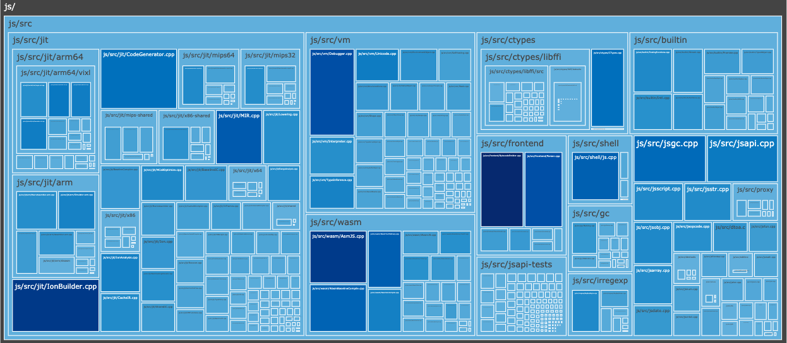

# lizardmap
A python script that can generate an interactive treemap visualisation of
cyclomatic complexities. (uses [plotly](https://plot.ly/) and
[lizard](http://www.lizard.ws/))



## Installation

```
pip3 install -r requirements.txt
```

## Usage

```
python3 lizardmap.py /path/to/project
```
